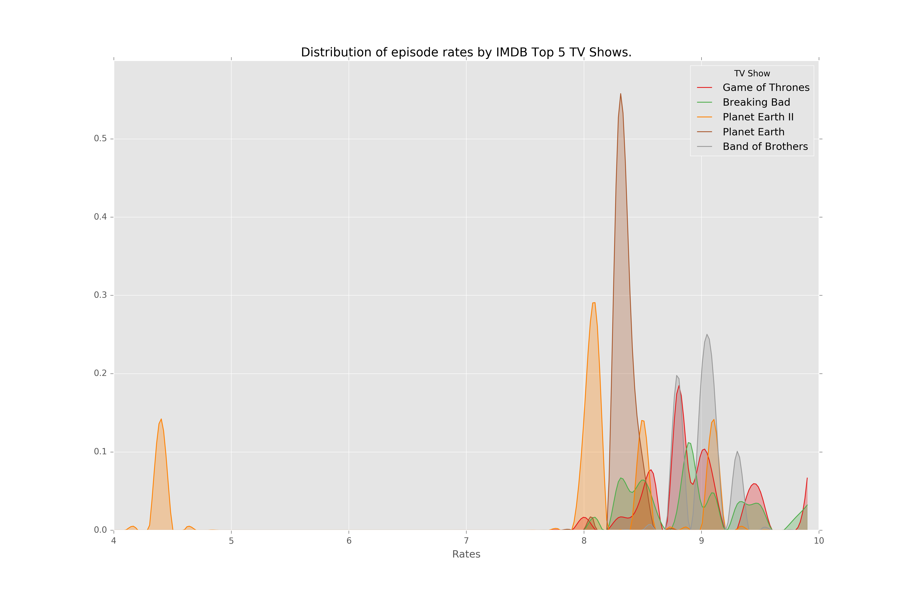

# topshows

I used IMDB as the source of the data. `get_data.py` create a file with the top n tv shows and their chapters with their respective rate.

In the notebook is the process to plot the distribution.

Here are the results:

